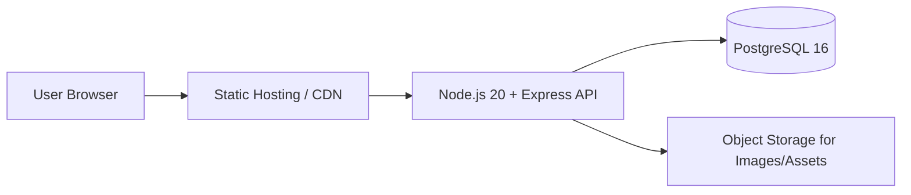

# Architecture Overview

## Target Architecture

## Data Flow Summary

1. A user loads the web UI from static hosting/CDN.
2. The UI sends API requests to the Express service (Node.js 20 runtime).
3. The API validates input, applies business rules, and reads/writes PostgreSQL 16.
4. Media/static blobs (if needed) are served from object storage, referenced by API records.
5. All services are deployed in **AWS eu-central-1 (Frankfurt)** to keep workloads in an explicit EU region.
